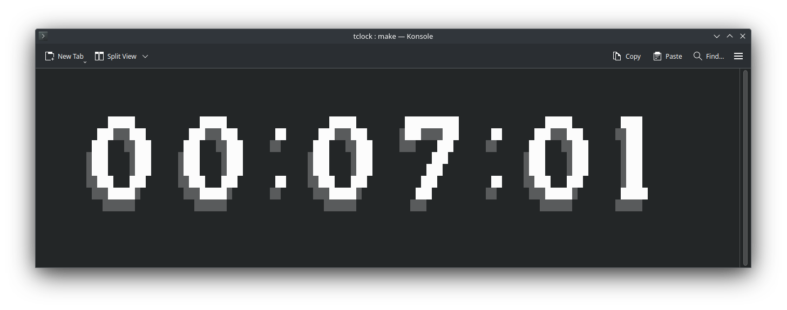

# TClock

- An ASCII digital clock in the terminal


## Installation

1. Clone the repo
```console
$ git clone git@github.com:NoSpawnn/TClock.git
$ cd TClock
```

2. Build and run
```console
# Build then run
$ make
$ ./tclock

# Build and run
$ make run
```

3. Add it to your path if you want
```console
$ cp ./tclock ~/.local/bin
```

## Usage

- Run the exectuable, quit with <kbd>Ctrl+C</kbd> or <kbd>q</kbd>

## TODO

- [x] Center clock in terminal
- [ ] Custom/Optional fonts
- [x] Fix `%` being printed when quitting?
